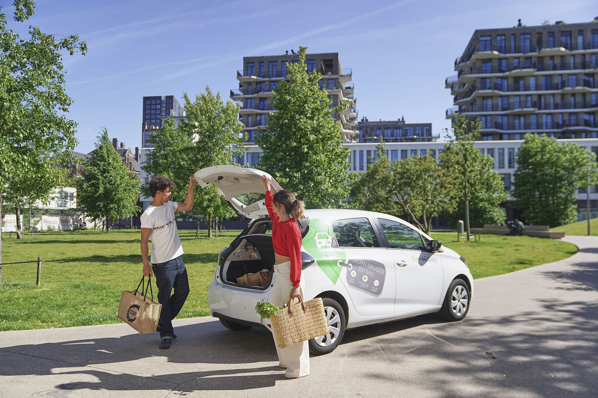
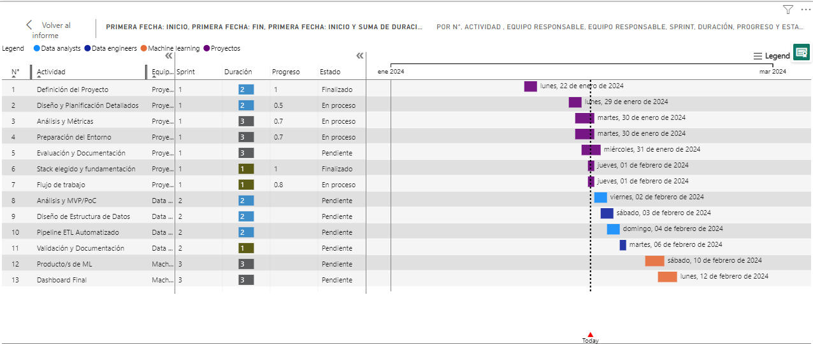
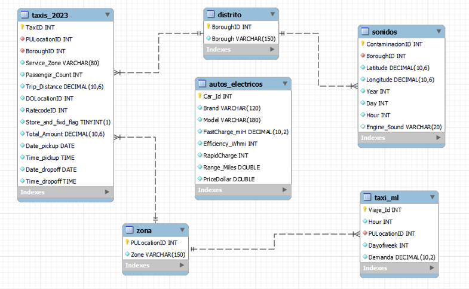
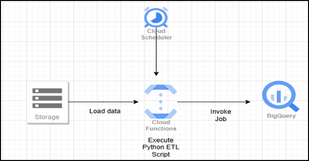
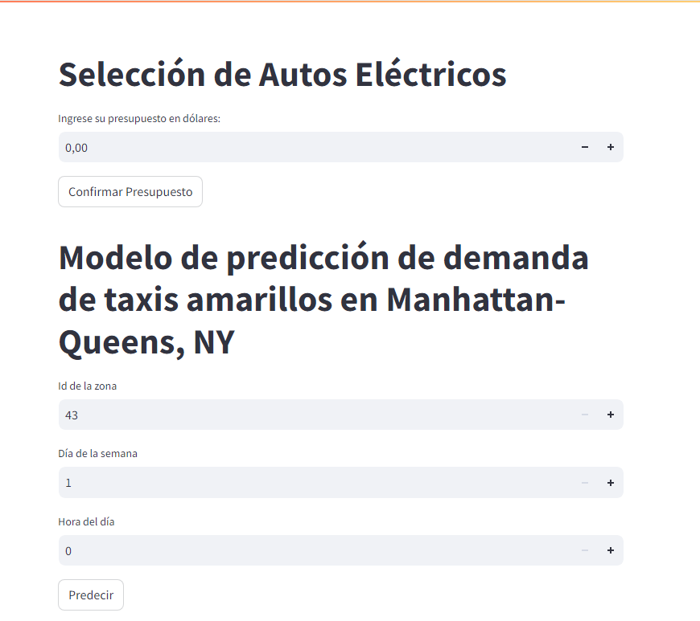

# GreenMobility Analytics

## Sprint I: Inicio del Proyecto y Trabajo con Datos

### Introducción

En el dinámico entorno urbano de la ciudad de Nueva York, los servicios de taxis y viajes compartidos han revolucionado la forma en que las personas se movilizan. Estos servicios no solo ofrecen una alternativa conveniente al transporte público y al alquiler de automóviles, sino que también generan vastas cantidades de datos que ofrecen una ventana única hacia los patrones de movilidad y la demanda de transporte en la ciudad.

Sin embargo, este avance en la movilidad no está exento de preocupaciones ambientales. El cambio climático, acelerado por la dependencia de combustibles fósiles, ha planteado la urgente necesidad de reducir las emisiones de carbono y mejorar la calidad del aire en las áreas urbanas. En este contexto, una empresa de servicios de transporte de pasajeros, con una visión orientada hacia un futuro más sostenible, busca incursionar en el sector de taxis y viajes compartidos en automóviles, considerando la posibilidad de integrar vehículos eléctricos a su flota.

Nuestro equipo ha sido contratado para acompañar este proceso de toma de decisiones, utilizando un enfoque basado en datos para analizar la relación entre los medios de transporte particulares y la calidad del aire en la ciudad de Nueva York. A través de la recopilación, depuración y análisis de datos provenientes de diversas fuentes, así como el desarrollo de modelos de machine learning, buscamos proporcionar información valiosa que respalde la evaluación de la viabilidad y los impactos potenciales de la transición hacia una flota de vehículos eléctricos.

En este proyecto, nos sumergiremos en el rico conjunto de datos disponibles, explorando las interconexiones entre el movimiento de los taxis, la calidad del aire y la contaminación sonora. A través de un enfoque multidisciplinario que combina análisis de datos, conocimientos en ciencias ambientales y técnicas de machine learning, aspiramos a ofrecer una visión integral que oriente las decisiones estratégicas de nuestro cliente hacia un futuro más limpio y sostenible para la movilidad urbana en Nueva York.

### Objetivos

- Recopilar, depurar y organizar datos relevantes.
- Desarrollar un Dashboard Interactivo para una mejor visualización y comprensión de los datos.
- Evaluar y comparar los costos y beneficios de los vehículos de combustión y eléctricos.

### Alcance

Este alcance proporciona un marco completo para abordar los objetivos del proyecto y ayudará a la empresa de servicios de transporte en su proceso de toma de decisiones relacionadas con la implementación de vehículos eléctricos en su flota.

### Planteamiento de KPI´s

- Aumentar las ventas promedio en un 10% respecto al mes anterior.
- Incrementar el número de viajes en un 5% respecto al mes anterior.
- Reducir la contaminación acústica en un 40% anual en el servicio de taxis dentro del Distrito de Manhattan.

### Metodología de Trabajo
   
   Adoptaremos una metodología ágil tipo Scrum, utilizando Trello como herramienta central para la organización y seguimiento de tareas.

   Horario de Daylis: Lunes – Viernes (9:00 – 11:00 / 16:00 – 18:00) HR ARG.

### Equipo de Trabajo. Roles y Responsabilidades

   - Data Analysts: Joyce Ruiz, Jovanni Escamilla.
   - Data Engineers: Joyce Ruiz, Jovanni Escamilla, Lucas Salzotto, Matias Barna.
   - Especialistas en Machine Learning: Matias Barna, Lucas Salzotto.

### Cronograma General de Actividades – Gantt

   

### Stack Tecnológico

   - Python
   - Pandas, Numpy, Matplotlib
   - Seaborn, Folium
   - Trello
   - GitHub
   - GCP
   - Power BI
   - Streamlit

### Flujo de Trabajo (WorkFlow)

   

### Diseño Modelo ER

  

Nuestro modelo de base de datos sigue un esquema relacional en forma de estrella, compuesto por una tabla de hechos y varias tablas de dimensiones.

Tabla de Hechos:
viajes_taxi 

Tablas de Dimensiones:
1.	Zona
2.	Distrito
3.	Electric_Car_Data
4.	Sonidos_Data

### Pepline ETL Automatizado

   

### Modelos de Machine Learning
https://modelosml-d7pd6opr7a-uc.a.run.app/

### Conclusiones

- Comprender el Impacto Ambiental: Nuestro análisis proporcionará una visión detallada de cómo la introducción de vehículos particulares afectará la calidad del aire y la contaminación sonora en las áreas urbanas. Esto permitirá a la empresa de transporte evaluar el impacto ambiental de su expansión y tomar medidas para reducir su huella ambiental.

- Validar la Visión de Futuro: Al corroborar la relación entre los medios de transporte particulares y la calidad del aire, nuestra investigación respaldará la visión de la empresa de un futuro menos contaminado y se alineará con las tendencias de mercado actuales hacia la sostenibilidad y la responsabilidad ambiental.

- Informar Decisiones Fundamentadas: Con el análisis preliminar del movimiento de los taxis en la ciudad de Nueva York, proporcionaremos un marco de referencia sólido para que la empresa tome decisiones bien fundamentadas sobre la implementación de vehículos eléctricos en su flota. Esto incluirá insights sobre patrones de movilidad, áreas de alta demanda y posibles impactos en la calidad del aire y la contaminación sonora.

- Optimizar Recursos: Al utilizar datos de alta calidad y cruzarlos con otros conjuntos de datos relevantes, nuestro enfoque integral permitirá a la empresa optimizar sus recursos y maximizar el impacto de sus inversiones en la movilidad urbana sostenible.

